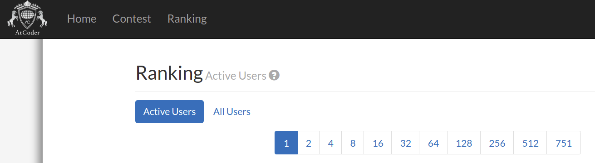

# hexo-bin-pagination

[](https://travis-ci.org/cromarmot/hexo-bin-pagination)
[](https://www.npmjs.com/package/hexo-bin-pagination)
[](https://coveralls.io/r/CroMarmot/hexo-bin-pagination?branch=master)

Binary Pagination utilities for [Hexo] generator plugins.

Based on [official pagination](https://github.com/hexojs/hexo/blob/2acded631448f36fafa9ac8d80bb9fcb73f74bb1/lib/plugins/helper/paginator.js)

This plugin will replace the default `helper.paginator`.

## Installation

```bash
$ npm install hexo-bin-pagination --save
```

## ref

Inspired by [atcoder.jp](https://atcoder.jp) and [pornhub.com](https://pornhub.com) 's pagination.

### atcoder.jp



### pornhub.com


## License

MIT

[Hexo]: http://hexo.io/
